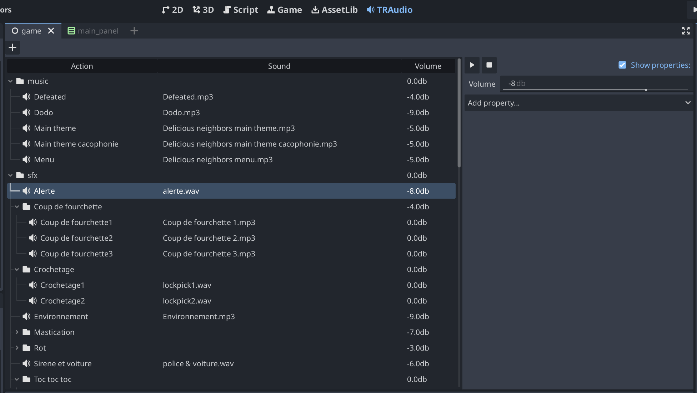

# TRAudio
A Godot addon to organize and handle sounds and audio parameters

I wrote this addon for our gamejam team Cularo Games (mainly
for the "Little Shadow" and "Delicious Neighbors" games), and
it saved us (mainly Tilca our sound designer, and me) lots of time.

While Godot has pretty nice features when it comes to audio, you
often end up with AudioStreamPlayers in many scenes. So either
the sound designer will have to know a lot about Godot and the
game's structure, or it will be necessary for a developer to
spend a lot of time applying sound settings all over the project.
Or both.

TRAudio tries to solve that problem by providing:

- an interface for sound designers to declare all sounds and their
  corresponding parameters (volume, pitch shift, attenuation setup etc.).
- a set of utility nodes for developers, where sounds can be played by
  name, parameters are automatically applied, and AudioStreamPlayer nodes
  (and their 2D and 3D counterparts) can be created and added to the node
  tree when needed.

TRAudio is not a replacement for Wwise or FMod, it's a solution when those
cannot be used (namely gamejams where Web exports are desired).

# Sound designer side: the TRAudio panel

The TRAudio panel can be used to declare all sounds of the project.
Sounds are organized in a tree view where you can define categories,
(any number of levels of) subcategories, and ultimately sounds.

Sounds and categories are refered to by their hierarchical name in
the tree view. Selecting an item in the view will copy the corresponding
hierarchical name into the clipboard (that's mainly useful on the developer
side so they don't have to type hierarchical names).

To add a category (or sound), just select the parent item, click the "+"
button, then edit its name.
To assign a sound, just drag it from the files panel to the item. It is possible
to define more complex AudioStreams in an inspector-like interface by unchecking
the "Show properties" box.

The Play/Stop buttons can be used to play the selected sound/category as they would
be played in game in an AudioStreamPlayer.

Playing a sound will assign all parameters to the AudioStreamPlayer, and play the sound.

Playing a category will play a random sound in the category (this is how
you can define several variations of a sound).

Each category and sound has a volume modifier. Those are added through the hierarchy,
which makes it easy to adjust volumes hierarchically for the whole tree.

Each category and sound has a set of optional parameters (Bus, volume randomness,
pitch shift, attenuation setup etc.). Deepest items setup will override their parent
for those parameters.

We typically create 3 top categories (music, ui and sfx) that define the corresponding
audio buses as targets, then store all music and sound effects in their corresponding
category (so the target bus parameter is only defined at top level).

# Developer side: utility nodes

Everything can be found in the documentation. Just look for nodes whose
names begin with TR. You may want to start with TRAudioAddon that explains
how to use the TRAudio singleton (you can just ignore undocumented methods).
